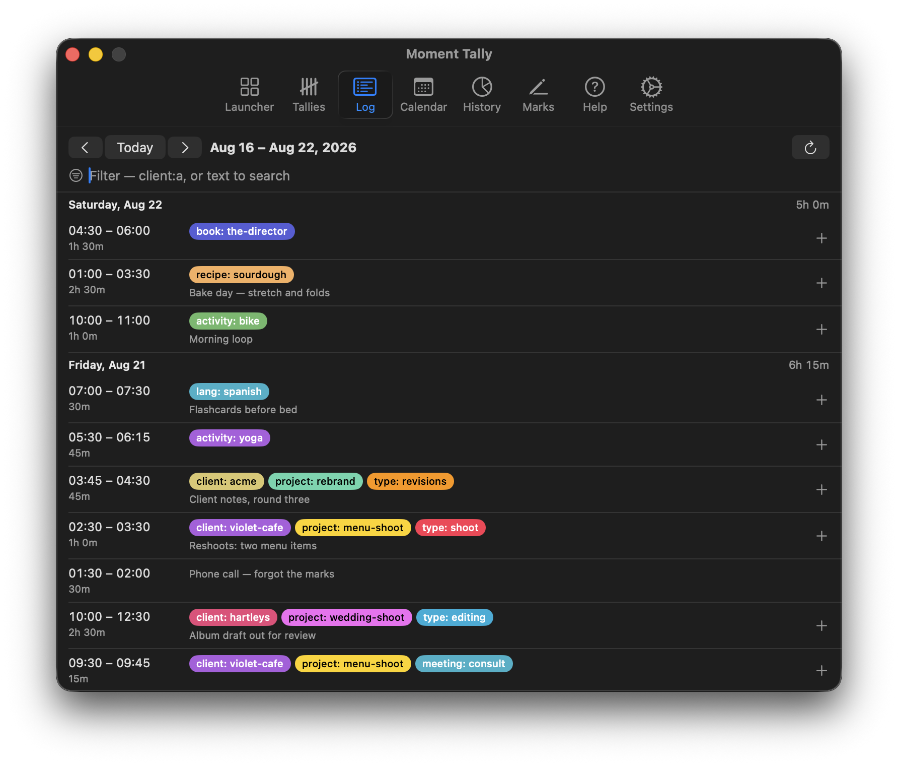
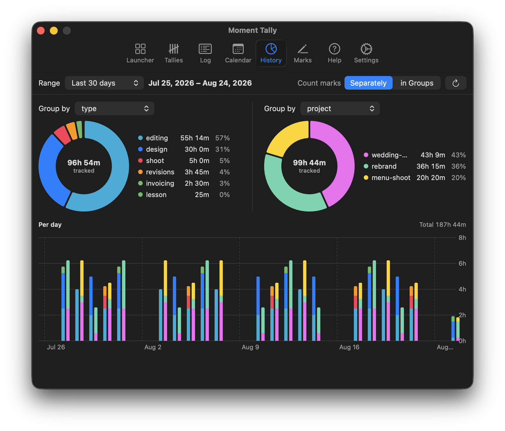
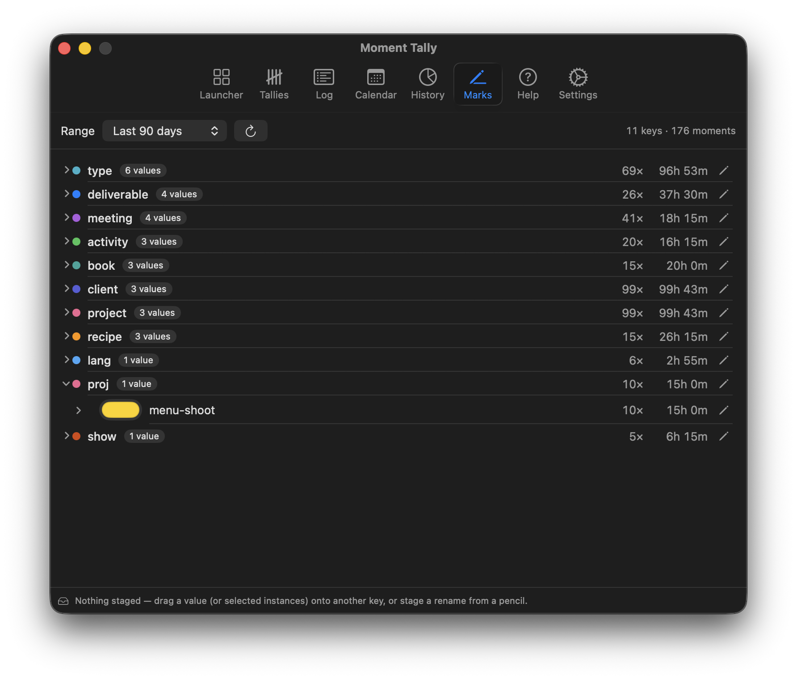

<p align="center">
  
</p>

<p align="center"><strong>Mark the moments of your day and see where the effort goes</strong></p>

> [!IMPORTANT]
> **PrimeTime is now Moment Tally.** Thank you to our early testers and users.
> The rename moved the brew tap and the in-app update feed, so 0.8.x installs
> won't see this release — install fresh under the new name below. Apologies
> for any inconvenience.

Moment Tally is a macOS menu-bar time tracker that marks and divides your time exactly how you want. Attach `key: value` marks to every moment — inspired by Prometheus metrics — and your time becomes queryable data, not entries filed into one rigid hierarchy. Start a timer in one keystroke, run several at once, then see where the day actually went. Offline-first: no account, no server, no network required.

## Install

```sh
brew install --cask sf1tzp/tap/moment-tally
```

Or download the latest notarized build from [GitHub releases](https://github.com/sf1tzp/moment-tally/releases): unzip and drag `MomentTally.app` into Applications. Either way the app keeps itself current — updates arrive in-app via Sparkle.

Requires macOS 14 (Sonoma) or later on Apple silicon.

<p align="center">
  
</p>

## Time, measured on your terms

- **Mark and divide time exactly how you want** — flexible `key: value` marks (`repo: app`, `type: review`, `team: platform`) make your time queryable across any axis you invent, without deciding a hierarchy up front.
- **Multi-task in the modern era** — multiple concurrent timers, flexible after-the-fact editing, and note-taking, because real work overlaps, gets interrupted, and needs correcting.
- **Visualize your workday** — see where the day actually went in calendar and chart views built from your own marks.
- **Own your data** — everything lives in a local SQLite store on your Mac. Sync is optional and goes through a server you host.

## Scriptable from the terminal

The app bundles a `moment-tally` CLI (at `MomentTally.app/Contents/Helpers/moment-tally`)
that works on the same local store:

```sh
moment-tally start -l repo=app -l type=review   # errors if a timer is running
moment-tally status --json                      # exit 0 running / 1 idle
moment-tally stop

moment-tally export > backup.json               # the full schema-versioned document
moment-tally export --from 2026-07-01 --to 2026-07-31 --include repo:app | jq
```

Data goes to stdout so it pipes; logs go to stderr. A running app picks up
CLI-started timers immediately. Filtered exports record their filter, so a
partial export can't pass for a full backup.

## A look inside

### Log

An editable record of your time: days, entries, notes, and running totals — nothing hidden. Adjust start/end times, marks, and notes after the fact.



### History

Donut and per-day charts over any grouping — and a second grouping to compare against, so "time by type" and "time by project" sit side by side.



### Mark Review

Vocabulary drifts — one week says `project`, a stray day says `proj`. Mark Review shows every key and value with usage counts, and cleans up drift with a drag or a rename.



There's more — a launcher of one-click tally cards, a calendar where overlapping timers share columns, and an interactive onboarding that teaches the mark model. See every surface in motion at [moment-tally.com/features](https://moment-tally.com/features).

## Try it: Demo Mode

Every capture above is Demo Mode — a seeded, throwaway copy of the app's data with a week of realistic history and two running timers. It can't touch real data: it lives in its own `demo.sqlite` (rebuilt on every launch) and a scratch settings domain.

```sh
git clone <this repo>
cd moment-tally
swift build
./.build/debug/MomentTally --demo
```

Look for the timer in the menu bar. Launch without `--demo` to start tracking for real.

## Sync with Moment Tally Server — optional

Moment Tally is local-first: the app is fully functional offline, and the local store stays the source of truth. When you want your history on more than one Mac — or shared across a team — run [Moment Tally Server](server/): a headless GraphQL backend, derived from [traggo/server](https://github.com/traggo/server) and evolved into the Moment Tally v1 API (mark vocabulary, per-value colors, server-side tallies). It ships as a single container backed by SQLite.

Connect in **Settings → Sync**: enter your server URL, sign in, and your local history uploads and stays in sync from then on.

## Import from Traggo

Coming from Traggo? **Settings → Import from Traggo** copies a Traggo server's full history — finished and running timespans, plus tag keys and their colors — into the local database. Safe to run again: already-imported timespans are updated, not duplicated.

## Development

A `justfile` is included for the edit-build-run loop:

```sh
just run-dev
```

It codesigns the debug binary with a local `TraggoMenuApp Dev` certificate so that Keychain access survives rebuilds. Create a self-signed certificate with that name in Keychain Access if you want the same behavior; plain `swift build` works fine otherwise (Demo Mode never touches the Keychain at all).

To remove local data and get a fresh install:

```sh
rm -rf ~/Library/Application\ Support/MomentTally && defaults delete MomentTally
```

Installed builds are sandboxed and keep everything inside their container
instead — remove `~/Library/Containers/com.streetfortress.MomentTally` to
reset one of those.

## Provenance

The `server/` tree is derived from [traggo/server](https://github.com/traggo/server); its provenance and licensing are documented in [server/README.md](server/README.md).

## Contributing

See [CONTRIBUTING.md](CONTRIBUTING.md) — in particular the contribution terms (DCO sign-off plus a relicensing grant) that keep Moment Tally's dual-channel distribution possible.

## License

[AGPL-3.0-or-later](LICENSE). The `server/` tree is derived from [traggo/server](https://github.com/traggo/server) and combines GPL-3.0 code with AGPL-3.0-or-later additions — see [NOTICE](NOTICE) and [server/NOTICE](server/NOTICE) for the structure. App-store builds are distributed under separate terms by the copyright holder ([NOTICE](NOTICE)).
